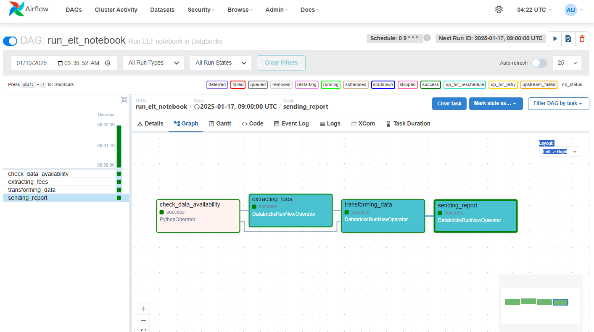
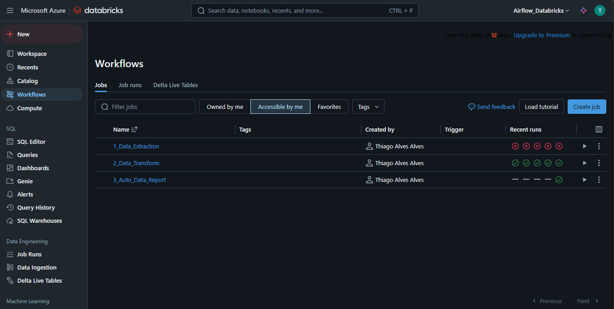
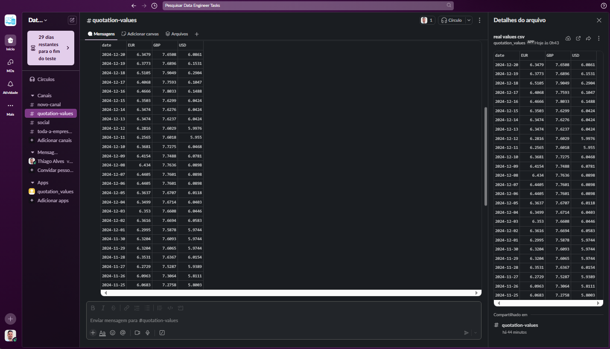
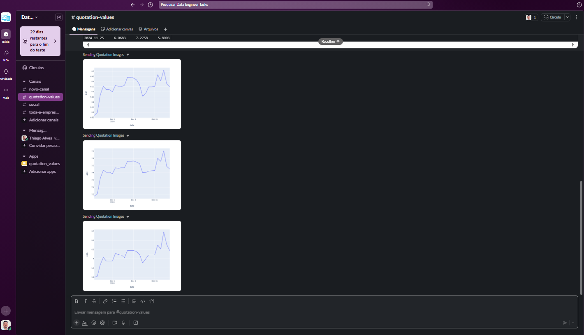
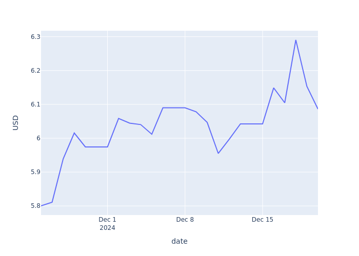
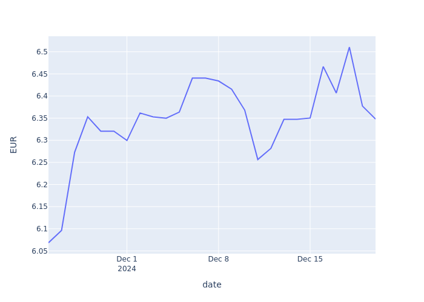
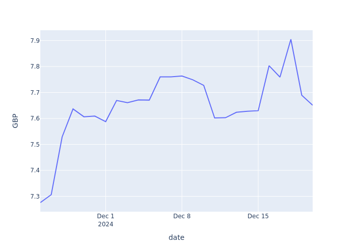

# Project: Data Pipeline with Airflow, Azure Databricks, and Slack Integration

## Overview
This project implements a data pipeline to extract, transform, and report currency exchange rates using Airflow, Azure Databricks, and Slack. The pipeline performs the following key steps:

1. **Extraction**: Fetches daily currency exchange rates from a public API.
2. **Transformation**: Converts rates into different formats, performs aggregations, and additional calculations.
3. **Reporting**: Sends transformed data and generated graphs to a Slack channel.

## Project Structure

```text
E:\Repositories\Data-Engineering\Airflow_Azure_Databricks_Pipeline
├── dags/                          # DAG files for Airflow
│   └── run_elt_notebook.py        # Main DAG file
├── notebooks/                     # Databricks notebooks
│   ├── notebook_extraction.py     # Data extraction logic
│   ├── notebook_transformation.py # Data transformation logic
│   ├── notebook_reporting.py      # Reporting and Slack integration
├── config/                        # Configuration files
│   └── settings.yaml              # Optional, for API keys, paths, etc.
├── images/                        # Output graphs and visualizations
│   ├── airflow_dag_complete.png   # DAG complete screenshot
│   ├── databricks_jobs.png        # Databricks jobs screenshot
│   ├── slack_message_csv.png      # Slack message screenshot with CSV
│   ├── USD_trend.png              # USD trend graph
│   ├── EUR_trend.png              # EUR trend graph
│   ├── GBP_trend.png              # GBP trend graph
├── data/                          # Data outputs
│   ├── bronze/                    # Raw data
│   ├── silver/                    # Transformed data
├── env/                           # Virtual environment (if needed)
├── README.md                      # Project documentation
└── requirements.txt               # Python dependencies
```

## Technologies Used
- **Airflow**: Orchestrates the pipeline.
- **Azure Databricks**: Processes and stores data.
- **Slack SDK**: Integrates and sends reports.

## Pipeline Components

### 1. Extraction

Data extraction is performed by a Databricks notebook, which fetches data from the Exchange Rates API:
- **API Used**: [exchangeratesapi.io](https://exchangeratesapi.io/)
- **Output**: Data is stored in the **Bronze** layer in Parquet format.

### 2. Transformation

Data transformation is executed in a Databricks notebook:
- **Filtering**: Processes only USD, EUR, and GBP.
- **Calculations**: Converts exchange rates to real values.
- **Output**: Data is stored in the **Silver** layer in CSV format.

### 3. Reporting

Reports are generated and sent to Slack:
- **CSV**: Files containing transformed exchange rates.
- **Graphs**: Line plots showing exchange rate trends.

### Airflow DAG

The Airflow DAG controls the execution of pipeline tasks:
- **`check_data_availability`**: Verifies the existence of data in the Bronze layer.
- **`extracting_fees`**: Runs the extraction notebook if needed.
- **`transforming_data`**: Executes the transformation notebook.
- **`sending_report`**: Executes the reporting notebook.

## Setup

### Prerequisites
- Python 3.8 or higher
- Airflow installed and configured
- Azure Databricks setup and accessible
- Slack authentication token

### Installation

1. Clone the repository:
```bash
$ git clone https://github.com/your-username/Data-Engineering.git
```

2. Set up the virtual environment:
```bash
$ python -m venv airflow_azure_databricks
$ source airflow_azure_databricks/bin/activate
$ pip install -r requirements.txt
```

3. Update credentials in the code:
   - Replace the Slack token in `notebook_reporting.py`.
   - Update the API credentials in the extraction notebook.

4. Configure connections in Airflow:
   - **Databricks**: Create a connection with ID `databricks_default`.

### Execution

1. Start Airflow:
```bash
$ airflow webserver &
$ airflow scheduler &
```

2. Enable the DAG `run_elt_notebook` in Airflow.

## Results

### Slack Messages Example
- CSV file sent as an attachment.
- Real-time exchange rate trend graphs.

### Output Images
Images are generated and stored in the `images` folder in the repository.

#### DAG Complete in Airflow
<p align="center">
  
</p>

#### Jobs in Azure Databricks
<p align="center">
  
</p>

#### Slack Messages
<p align="center">
  
</p>

#### Slack Graphs
<p align="center">
  
</p>

#### Example Graphs

<p align="center">
  
</p>

<p align="center">
  
</p>

<p align="center">
  
</p>

## Data Layer Structure
- **Bronze**: Raw data in Parquet format.
- **Silver**: Transformed data in CSV format.

## Next Steps
- Automate sensitive credential authentication using Azure Key Vault.
- Add support for additional currencies.
- Expand the pipeline to include other financial market APIs.

## Contribution
Feel free to open issues or submit pull requests with suggestions for improvements.