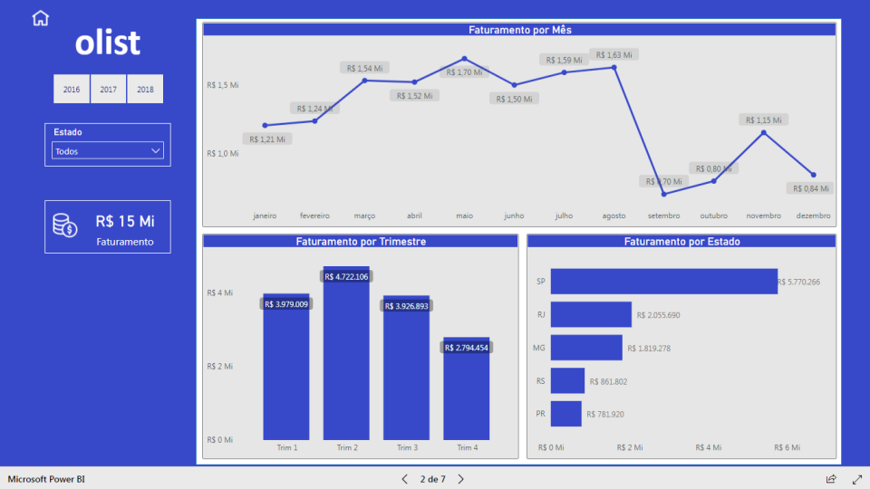

# E-commerce Data Pipeline with Azure & Power BI

  

[Live Dashboard Link](https://app.powerbi.com/view?r=eyJrIjoiNmUzMWZkMDQtNGM5OS00YTcwLThhNGQtNjg1NzQ5ZGVhMzJjIiwidCI6ImU1YTM3MzU2LTI2MjYtNGI0ZC05NTA5LTdiNmQxODA0ODU5ZiJ9&pageName=ReportSection)

## Project Objective

Develop an automated data pipeline and interactive business intelligence solution to analyze Brazilian e-commerce patterns, identify growth opportunities, and drive data-driven decision making.

  

## Dataset Overview

### Brazilian E-commerce Dataset

[Dataset Source](https://www.kaggle.com/datasets/olistbr/brazilian-ecommerce) from [Olist](https://olist.com/)  
Contains comprehensive transactional data including:

- Order details
- Product information
- Customer demographics
- Seller performance
- Review ratings

  

## Key Deliverables

1. **Automated ETL Pipeline**: Robust data processing workflow
2. **Interactive Power BI Dashboard**: [Live Access](https://app.powerbi.com/view?r=eyJrIjoiNmUzMWZkMDQtNGM5OS00YTcwLThhNGQtNjg1NzQ5ZGVhMzJjIiwidCI6ImU1YTM3MzU2LTI2MjYtNGI0ZC05NTA5LTdiNmQxODA0ODU5ZiJ9&pageName=ReportSection)
3. **Business Insights Report**: Strategic recommendations PDF
4. **Technical Documentation**: Complete project blueprint
5. **Video Walkthrough**: Solution demonstration [Link Coming Soon]

## Core Technologies
- **Azure Services**: Data Factory, Databricks, Synapse Analytics
- **Business Intelligence**: Power BI
- **Data Processing**: Python, PySpark, Pandas
- **Orchestration**: Azure Data Factory
- **Data Storage**: Delta Lake, Parquet, SQL Database

## Pipeline Components

### 1. Extraction Layer
- Sources: Kaggle API, Olist production database
- Raw Data Formats: CSV, JSON
- Storage: Azure Data Lake (Bronze layer)

### 2. Transformation Layer
- Data Cleaning: Missing value handling, outlier detection
- Feature Engineering:
  - Customer lifetime value
  - Seller performance metrics
  - Product category analysis
- Storage: Azure Synapse (Silver layer)

### 3. Analytics Layer
- Star Schema Modeling: Optimized for BI tools
- Automated Reporting: Power BI dataflows
- Storage: Azure SQL Database (Gold layer)

## Implementation Guide

### Prerequisites
- Azure account with Data Factory access
- Power BI Pro license
- Microsoft SQL Server Management Studio (SSMS)

## Next Improvements
- Implement real-time data streaming
- Add customer churn prediction model
- Integrate Azure Machine Learning
- Develop anomaly detection system

## Contribution
Contributions welcome! Please:
1. Fork the repository
2. Create your feature branch
3. Submit PR with detailed description

---
