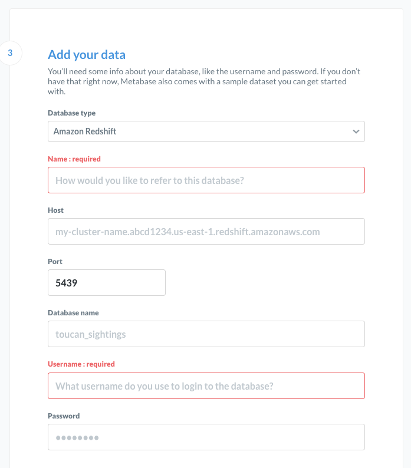

# Integrating Redshift into a BI tool

The process of connecting Redshift to a BI tool is always very similar, no matter which tool you use.
Here we are going to use [Metabase](https://www.metabase.com/start/oss/) with Docker.

```
docker run -d -p 3000:3000 --name metabase metabase/metabase
```

1. Access Metabase at `localhost:3000`
2. Get your Redshift host from the AWS dashboard (remember the username and password are hardcoded into the Redshift template for now)
3. In step 3 of Metabase configuration, add your data.

4. Create your queries and dashboards!