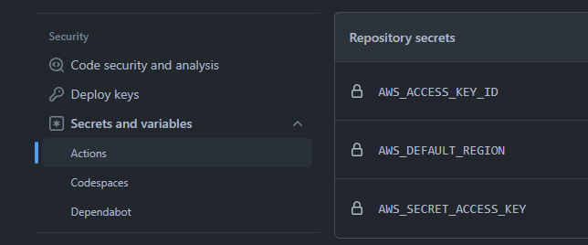

# Using GitHub Actions

How to use:

1. Set your AWS credentials within your repository on GitHub.
    1. Access the repository and go to settings -> secrets

    1. Add the credentials of a user who has sufficient permissions to deploy Cloudformation templates
        
        a. AWS_ACCESS_KEY_ID

        b. AWS_DEFAULT_REGION

        c. AWS_SECRET_ACCESS_KEY

    

2. Create a branch called `1.github_actions`
    1. `git checkout -b 1.github_actions`

3. The file that will control this workflow is in `.github/workflows/1.github_actions.yaml`
    1. The workflow will be executed when pushing to branch `1.github_actions`

        a. `git push --set-upstream origin 1.github_actions`

4. Watch GitHub deploy your infrastructure within the **Actions** tab

**Remember to always delete your stacks after class to avoid unexpected charges on your AWS**